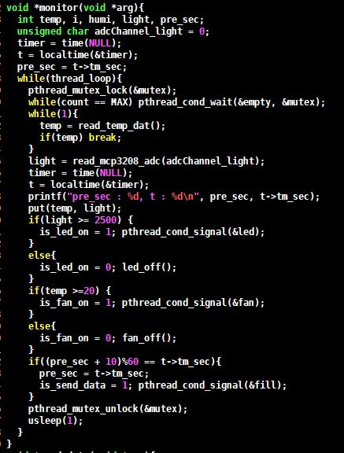
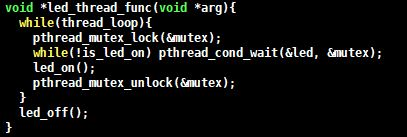
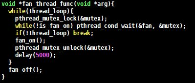
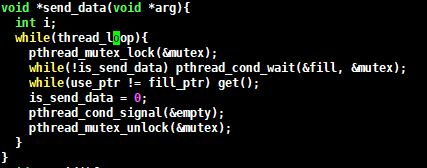
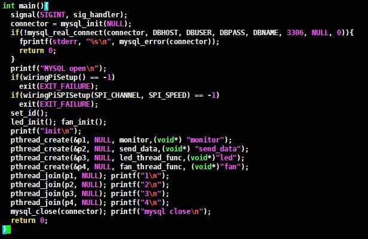
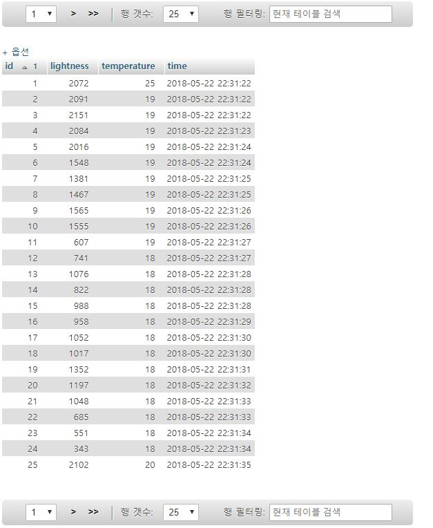
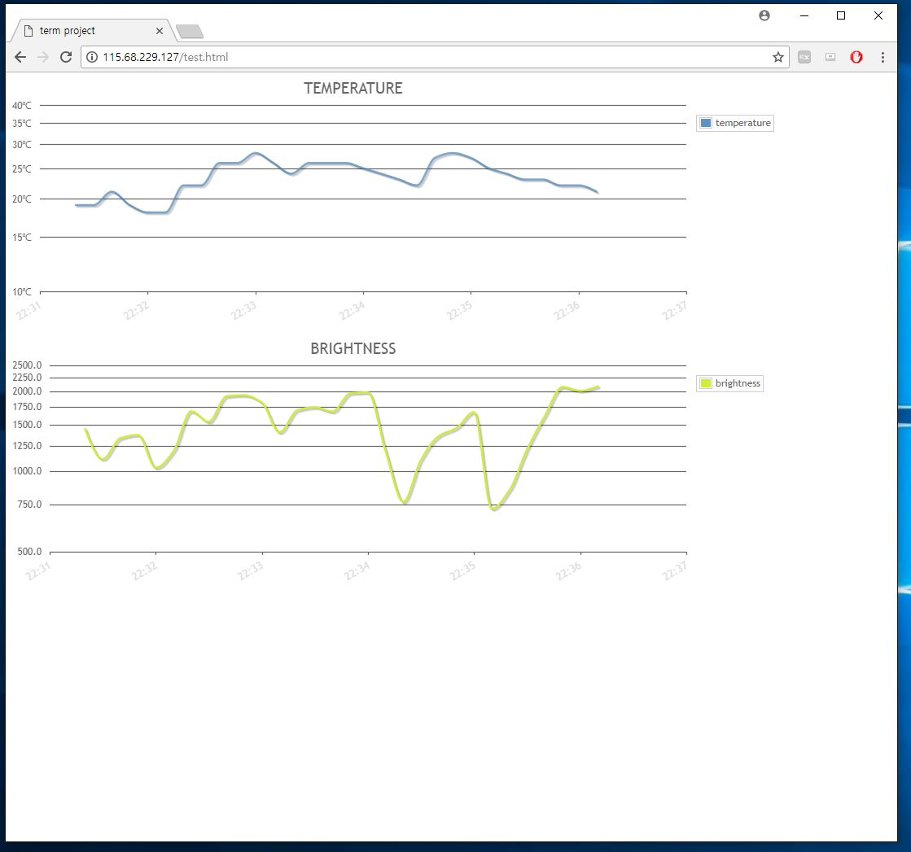

# Smart Farm

## 1. Overview
The project name is Smart farm. it uses a particular module to measure temperature and brightness. when temperature and brightness is beyond a certain range, fan is ranning and red led is turned on. and All data that is monitored are sended from Raspberry Pi to the server every 10s.

## 2. Requiremnets
 - Monitor temperature and lightness on every 1ms.
 - Use an analogous data for a ligthness sensor. 
 - Build a server in cloud and install MySQL and Apache into it. 
 - Send sensor data from Raspberry Pi to the server every 10s. 
 - Turn on FAN when the temperature goes beyond 20 degrees (C)  for 5 second. 
 - Turn on LED when the lightness goes below 2500 and turn off it otherwise. 
 - Each functionality should be performed by an independant thread
 - Use a signal mechanism when threads need to communicate each other. 

## 3. Implementation
* ## monitoring thread  
      
    this thread is monitoring of sensor data. it monitor temperature and brightness on every 1ms. but It works differently in practice. because gettng the temperature data takes a long time.  
    So, if the temperature data that is monitered is greater than 20 degrees, send a signal to the fan thread that is asleep.
    Likewise, if the brightness data that is monitered is greater than 2500 degrees, send a signal to the led thread that is asleep.
    lastly, After 10 seconds, send ad signal to the send data thread.
* ## led thread
      
    this thread is turning on red led.  
    if it doesn't receive a signal, the condition of this changes to wait. and then when it receive the siganl, turn on the red led.
* ## fan thread
      
    this thread is turning on fan.  
    if it doesn't receive a signal, the condition of this changes to wait. and then when it receive the siganl, turn on the fan for 5 seconds.
* ## send data thread
      
    this thread is sending monitored data from raspberry to the cloude server.  
    if it doesn't receive a signal, the condition of this changes to wait. and then when it receive the siganl, send all data to cloud server.
* ## main
      
    when the program starts, register the signaling and make a connection withe the database. and then create the above four threads after initialization for each function. lastly wait for all thread to finish.

## 4. Capture the data on the web server
* ## database that is shown by phpmyadmin
    

* ## graph of average data in 10 seconds
    

## 5. Demo Video
    https://youtu.be/ioDJsIqziq4