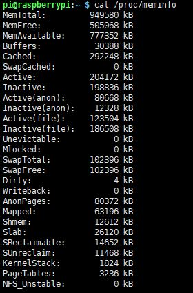
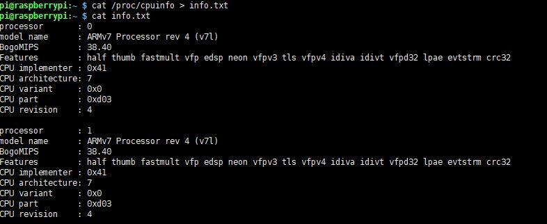

# **Linux practice**
### *2주차 실습내용에 대한 정리*
---------
2주차 실습은 리눅스에서 자주 사용되고 기본적인 세팅에 사용되는 명령어에 대한 실습을 진행하였다.  
일단 1주차 실습 때 라즈베리파이에 라즈비안이 모두 설치를 하였고, 기본 update, upgrade는 실행시킨 상태이다.  
나는 실습을 진행할 때 라즈비안의 터미널을 사용하지 않고 Xshell5이라는 프로그램을 통해 라즈베리파이에 접속하여 실습을 진행하였다.  

--------
## **1. ssh**실행 및 **port** 번호 변경

다음과 같은 명령어를 통해 ssh를 실행시켜 보았다. (이미 라즈비안에는 기본으로 설치되어있는 것으로 알고있다.)

>openssh pi@localhost

응? 분명 설치가 되어있는데 접속이 안된다. 혹시 몰라 다시 설치해보아도 이미 설치가 되어있다고 한다....  
아.. 원인을 찾아보니 *ssh* 데몬이 실행이 안 된 상태였다. 다음과 같이 데몬을 시작해주니 바로 해결이 되었다.
>sudo service restart ssh

well-known port로 알려져있는 ssh 포트인 22번 포트는 위험하니 다른 것으로 바꿔주자.
다음의 파일을 그림과 같이 수정하면 포트를 바꿀 수 있다.
>/etc/ssh/sshd-config  

자 그러고 다시 접속해보자. 아래와 같이 10022포트로 접속이 된 것을 확인할 수 있다.  

첫 번째 practice는 이로써 완료하였다.(편안..)

-------
## **2. apt-get repository** 변경
*apt-get*.. 데비안 계열의 리눅스에서 사용하는 패키지 관리 명령어 도구이다. 이 명령에는 기본적으로 설정되어 있는 repository가 있다. 하지만 그 repository는 저 멀리 있는 서버에 존재함으로 일반적으로 사용하는데 문제는 없지만 속도가 느리다..  
그래서 일반적으로 https://ftp.daumkakao.com 으로 바꿔 사용한다.  
**하지만!!** 여기는 우분투환경이 아니다!! 라즈비안이다!   
직접 저 ftp 주소로 접속해보면 라즈비안을 지원을 하지않는다..  
그럼 어떻게 해야할까? 두가지 방법이 존재한다.  
1. 기존 파일의 맨 아랫줄의 주석을 해제하여 아카이브를 추가하는 방법!

2. 미러링 주소를 바꾸는 방법!  
  

나는 두번 째 방법을 선택하였다.  
 미러링 주소는 https://www.raspbian.org/RaspbianMirrors/ 여기서 알수있다.
접속해서 확인해보면 한국에 있는 미러링 주소가 있다.  
난 카이스트로 바꿨다. 속도가 빠르다고 한다. ㅎ  
  
자 문제없지 진행된다. 굳!!  

------
## **adduser** 명령어로 user 추가하기
리눅스 명령어를 통해 user를 추가해보자. 유저를 추가할려면 루트권한으로 접근해야한다.  
>sudo adduser 'userid'  
  

허허 중간에 입력을 잘못해서 다시 입력했다. 위과 같이 나오면 유저가 생성된 것이다.
유저가 생성되었는지 어떻게 확인을 할까?  
다음 명령어를 통해 확인할 수 있다.
>cat /etc/passwd  
  

위과 같이 맨 아래 추가되었음을 알 수 있다.  

자 이제 원하는 정보를 찾고 정렬을 해보자!  
이때 파이프 라인을 사용하면 매우 편안하다.  
자! 다음과 같은 명령어로 아래와 같이 첫번째 열만 뽑아 내보자
>cat /etc/passwd | awk -F: '{print $1}'  
  

잘나온다 이걸 **정렬**해서 볼려면?
>cat /etc/passwd | awk -F: '{print $1}' | sort  
  

반대로 정렬은? -r옵션을 주면끝!  

>cat /etc/passwd | awk -F: '{print $1}' | sort -r  
  

자 반대로 정렬이 되었다. 저기에 아까만든 test user를 확인할수 있다.  

여기서 **awk**명령어에 대해서는 다음 주소를 활용하자..ㅎ https://zetawiki.com/wiki/%EB%A6%AC%EB%88%85%EC%8A%A4_awk

------
## **라즈베리파이**의 하드웨어 성능을 확인하기
이번에는 라즈비안의 하드웨어 성능을 확인해볼 것이다.  
먼저 cpu성능은 다음에 저장되어있다.   
>/proc/cpuinfo  

다음과 같은 **cat**명령어를 통해 확인해보자
>cat /proc/cpuinfo  
  

생각보다 정보가 많이 나온다...
원하는 정보는 grep으로 뽑아서 보는게 편할거같기도 하다.  
그리고 아키텍쳐를 확인해보자 arch명령어로 간단히 해결 가능하다.
>arch
 
 
음... 인텔이 아닌 arm을 이용하는 것을 알수있다..ㅎ
그다음은 메모리 정보를 알아보자.  
메모리 정보도 cpu정보와 같이 */proc* 에 저장되어있다.
>cat /proc/meminfo  
  

이것도 내용이 참 많이 나온다... 이것도 가능하면 grep으로 뽑아서 확인하자..ㅎ

------
## **라즈베리파이**의 하드웨어 성능을 저장하기
이제 뽑아낸 정보를 저장해보자!  
방법은 간단하다. redirection 기능을 이용하면 쉽게 해결.  
>cat /proc/cpuinfo > info.txt
  

자 위과 같이 저장되었다. 아주 좋다.  
저기다 메모리 정보까지 붙여 넣고 싶은데 어떻게 해야할까?  
그냥 리다이렉션만 하면 기존의 내용은 날라가버린다. 이럴떄는?  
redirection 명령어?를 두개를 붙여버리자. 그러면 맨 뒤에 내용이 붙게 된다!
>cat /proc/meminfo >> info.txt  
  

내용이 길지만 맨 아래 붙어있는걸 알 수있다. 오늘의 실습은 끝!  
아 여기서도 원하는 정보를 grep으로 뽑아낼 수는 있다.
>cat info.txt | grep "processor"  
cat info.txt | grep "MemTotal"  
  

